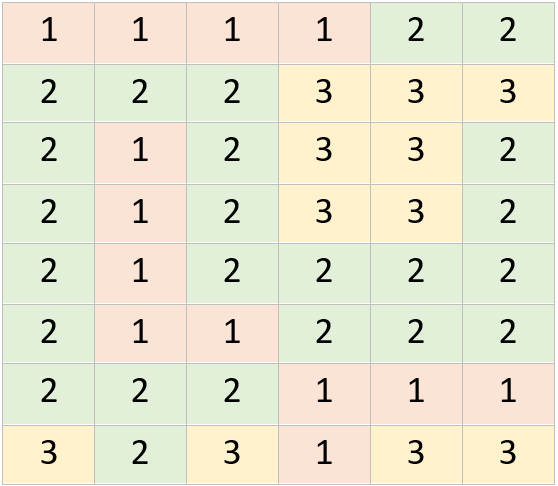

# Countries challenge data
Analyzing a 2d array.

## Details
A grid is devided by countries (numbers), make an application that will show the total regions on the grid.
A country region is defined as every coordinate that is linked (N,E,S,W) with another coordinate from the same country.
 
Example: 
Country 1 has 3 regions. 
Country 2 has 2 regions. 
Country 3 has 4 regions. 
Result should be 9. 

 
